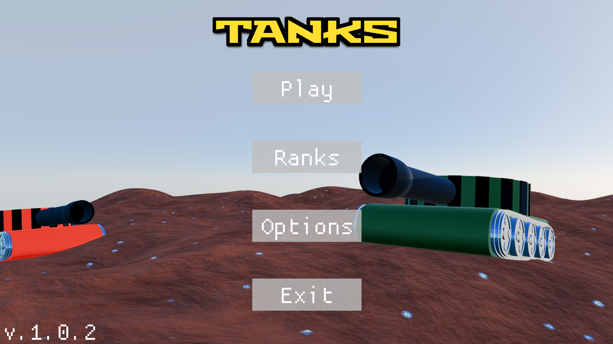
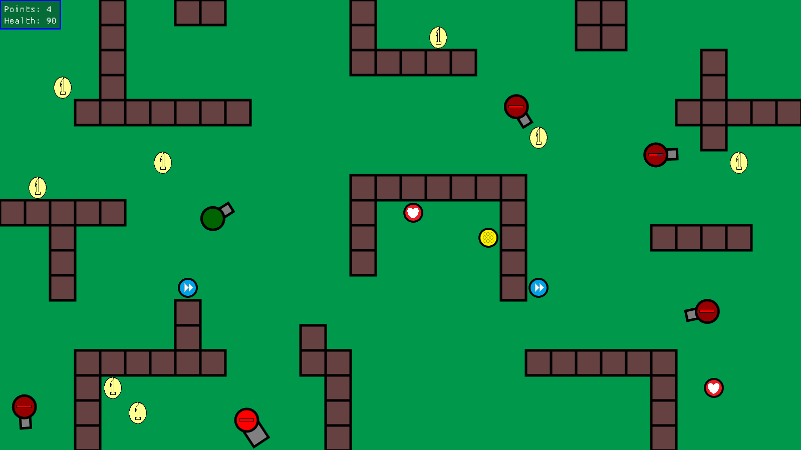

# Tanks
## About Project

Tanks is a simple game made in cpp. Player has to move tank and collect points. If the player gathers enough points, the game will rank player on the leaderboard. During game player will have to fight with enemies, who will try to kill him. Game has simple 2D graphic based on sfml's shapes.

## How to run this game

1. The game will be avaible for free on itchio. Dowload it -> unzip -> run Tanks.exe.
   The game may require some additional libraries. They should be delivered in .zip file. In case they won't work, you will need to instal microsoft visual c++ redistributable package (64-bit) [1](#link1) .
2. Download this repository as .zip and unzip it. Then run Tanks.sln in Visual Studio 2022. You will also need to create Music folder and add .mp3 files - more in [Music](#music) .

## Libraries and Technologies Used

- Visual Studio 2022
- ISO C++17 Standard
- dear imgui, v1.91.9
- SFML v. 3.0.0

## Main menu

The game has 2 stages in stage machine - *game* and *main menu*. When the player enters the game, the game will be in *main menu* stage. The same will happen when the player exits the *game* stage. 

*Main menu* stage bases on different screens like options, credits, etc. All screens have dedicated value in enum *Screen*, and the game will render the specific screen based on the value of the specyfic variable. The player can change the value of that variable by clicking on buttons. 
There are also 2 special values in enum that don't have a dedicated screen in main menu. They are used to navigate to *game* stage and exit game. 

Almost everything what is inside differents main menu's screens based on 2 funcions:
- *TextPattern*
- *ButtonPattern*  

These functions configure text and buttons based on specified values, speeding up the process of adding new screens to the main menu and customizing their content.

## Game

Game is based on input -> update -> render loop *(a.k.a game loop)*. Render consists of three phases: clear, draw, and display.  

At the start, the game will either load a level from a file or generate one, depending on the user's selection in the *main menu* stage. 

The game spawns:
- Coins - every 6 seconds
- Power ups - every 9 to 14 seconds
- Enemy - every 15 seconds and this values goes down to 4 seconds - every enemy spawns 0.1 second quicker  

Spawn algorithm: The game will select random position. If it's empty than spawn, otherwise select by recurency next position next to previous. This recurency will work until it spawns object or it will not find any empty place.

**Power Ups**  
There are 3 power ups:
- Increase speed (temporary)
- Quickfire (temporary)
- Restore Health (the rarest)  

**Controls:** When player is holding RMB tank's moving to the cursor. The player can shoot using LMB. 
Player has 100 hp and will lose if hp is equal 0. In that case stage in stage machine will be changed to *main menu* stage.

## Enemies

There are 3 types of enemy:
- Normal enemy - similar to player
- Fast enemy - moves faster, shoots quicker, but weaker and has low hp.
- Big enemy - moves slower, shoots are stronger and slower and has a lot of hp.  

Every enemy has the same idle state. It moves forward and if it hits wall, it rotates and move in different direction. 
Enemy can see player when:
- player tanks will be too close
- when the player is in front of them 

In the second case enemy checks it with raycast. It creates an invisible line between player and enemy and checks if there is any wall between them. If not - enemy sees player. 
When player shoots enemy, it will rotate and starts moving forward in opposite direction to player's bullet.

When enemy sees player, it will follow player's tank and shoot as often as it can.

## Music

Originally, the repository included a Music folder containing two MP3 files: Polkka.mp3 and TheBuilder.mp3. If you download the repository as a .zip file, you will need to manually create the Music folder and add these files. Without them, the game will fail to compile due to missing resources.

**Music credits:** 
Music was made by Kevin MacLeod. 
Songs used: Polkka [2](#link2) and The Builder [3](#link3)

## Links
[1] microsoft visual c++ redistributable package (64-bit) https://aka.ms/vs/17/release/vc_redist.x64.exe  
[2] Polkka https://youtu.be/JbspWYbuxgE?si=Jevp-t-NAqB3K1Mb  
[3] The Builder https://youtu.be/G6G3gB7DksA?si=RjfAjZmqEckYDM9p  
